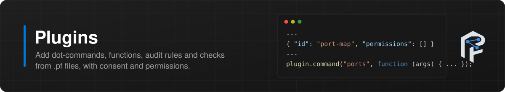
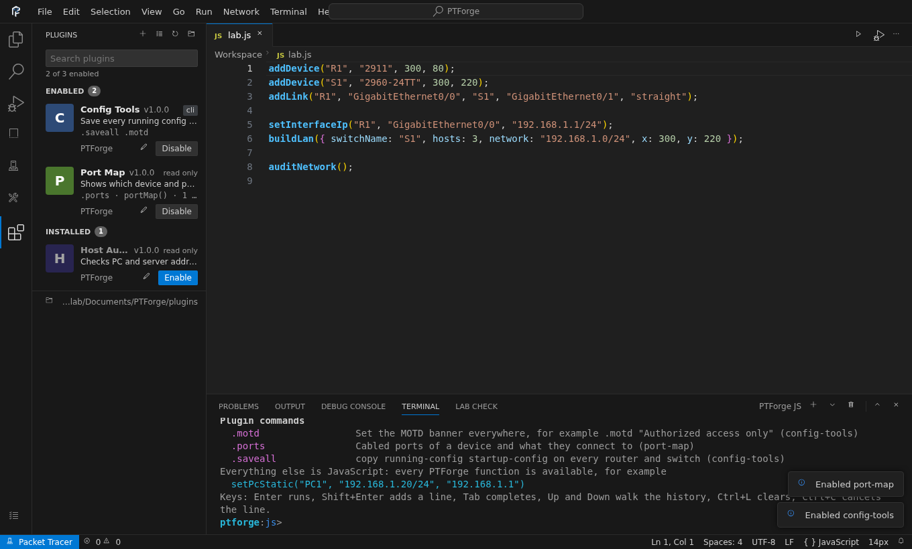
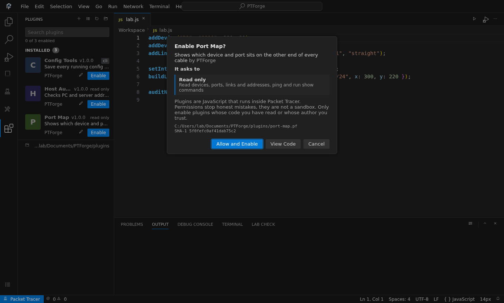

<div align="center">

<picture>
  <source media="(prefers-color-scheme: dark)" srcset="assets/brand/logo-dark.svg">
  
</picture>

<br><br>

**Build, configure, debug and verify entire Cisco Packet Tracer networks with JavaScript.**

[](https://github.com/r4chan842/PTForge/releases/latest)
[](LICENSE)


[Quick start](#quick-start) ·
[Installation](docs/guides/installation.md) ·
[Documentation](docs/README.md) ·
[API](docs/api/README.md) ·
[Examples](examples/README.md) ·
[CCNA map](docs/ccna/README.md)

**English** ·
[فارسی](i18n/README.fa.md) ·
[Deutsch](i18n/README.de.md) ·
[Español](i18n/README.es.md) ·
[Français](i18n/README.fr.md) ·
[Português](i18n/README.pt-BR.md) ·
[Русский](i18n/README.ru.md) ·
[Türkçe](i18n/README.tr.md) ·
[العربية](i18n/README.ar.md) ·
[中文](i18n/README.zh-CN.md) ·
[日本語](i18n/README.ja.md)

</div>

---

## Why PTForge

Building a lab in Packet Tracer means dragging devices, picking cables, opening every CLI and typing the same commands again and again. One typo in a VLAN list or a wildcard mask can cost an hour.

PTForge replaces the clicking with a script. You describe the network once, press **Run**, and Packet Tracer builds it: devices, modules, cables, IOS configuration, server services, wireless, labels and zones. Then PTForge reads the live state back, so the same script can verify its own work.

- **Repeatable**: rebuild a lab from scratch in seconds, as often as you want
- **Shareable**: a lab is a text file you can send, review and keep in Git
- **Correct**: addresses, masks and wildcards are calculated, and typos throw clear errors
- **Verifiable**: inspection functions read VLANs, trunks, STP, port security and routing processes directly from Packet Tracer
- **Debuggable**: set breakpoints, step through a script and read every variable, like in VS Code
- **Interactive**: a JavaScript terminal changes the open topology one line at a time

<div align="center">

<br><sub>The PTForge workbench inside Packet Tracer: explorer, tabs, IntelliSense, Dark Modern highlighting and output</sub>
</div>

## What's new in 1.3

| | |
|---|---|
| **Plugins** | Drop `.pf` files into the plugin folder to add terminal dot-commands, global functions, audit rules and Lab Check checks. Three ready plugins ship in [`plugins`](plugins) |
| **Plugin Manager** | `Ctrl+Shift+X` lists every plugin with version, permissions and what it adds. Enable asks for consent, and a plugin whose file changes stays off until you review it |
| **Permissions** | Plugins are read only unless they ask for `topology`, `cli`, `files` or `raw`. Calls outside the granted permissions fail with a clear error |
| **Codicons** | Every icon is now an official VS Code Codicon (CC BY 4.0), drawn on the same grid and sizes as VS Code |
| **Complete host details** | `getPcIp()` returns gateway, DNS, MAC, IPv6, link-local and link state. `getPortInfo()` names the device on the other end. The terminal prints deep objects and long arrays in full |
| **Background ping and traceroute** | `ping()`, `traceroute()` and `pingAll()` wait for Packet Tracer to finish, so results are never zero. `traceroute()` returns every hop |

## Quick start

1. Download the [latest release](https://github.com/r4chan842/PTForge/releases/latest) and follow the [installation guide](docs/guides/installation.md)
2. Open `Extensions` → `PTForge Editor`
3. Open a script from [`examples/`](examples/README.md) with `Ctrl+O` and press `Ctrl+F5` to run it, or `F5` to debug it
4. Press `` Ctrl+` `` and try `getDevices()` in the terminal
5. Check the result with `auditNetwork()`, `pingAll()` or a [Lab Check](docs/api/checks.md)

## A taste

```js
buildLan({ switchName: "S1", hosts: 4, network: "192.168.10.0/24", x: 300, y: 250 });
addDevice("R1", "2911", 300, 80);
addLink("R1", "GigabitEthernet0/0", "S1", "GigabitEthernet0/1", "straight");

basicSetup("R1", { secret: "class", consolePassword: "cisco", banner: "Authorized access only" });
setInterfaceIp("R1", "GigabitEthernet0/0", "192.168.10.1/24");
configureSsh("R1", { domain: "lab.local", username: "admin", password: "Adm1n!Pass" });

createVlans("S1", { 10: "USERS", 99: "MGMT" });
setAccessPort("S1", ["FastEthernet0/1", "FastEthernet0/2"], 10, { portfast: true, bpduguard: true });
configurePortSecurity("S1", ["FastEthernet0/1", "FastEthernet0/2"], { maximum: 2 });

drawZoneAround(["S1", "PC1", "PC2", "PC3", "PC4"], "VLAN 10 - Users", "green");
labelAllDevices();

takeSnapshot("baseline");
pingAll();
```

Twenty lines give you a router, a switch, four addressed PCs, a hardened router with SSH, VLANs, secured access ports, a labelled diagram, a saved baseline and a full reachability test.

## Features

| Area | What you can do |
|------|-----------------|
|  **Devices** | Add, remove, rename, move, power cycle, install modules, read ports, store custom data, place devices in the physical workspace |
|  **Links** | Every cable type, delete links, auto connect, list neighbors, check link state |
|  **Hosts** | Static or DHCP IPv4, IPv6 with SLAAC, gateway, DNS, firewall, command prompt |
|  **Cisco IOS** | Basic setup, passwords, banners, users, interfaces, subinterfaces, loopbacks, router on a stick, DHCP pools and relay, NTP, syslog, SNMP, CDP, LLDP, show commands |
|  **Switching** | VLANs, access and voice ports, trunks, DTP, EtherChannel (LACP, PAgP, static, layer 3), Rapid PVST+, PortFast, BPDU guard, VTP, port security, DHCP snooping, DAI |
|  **Routing** | Static and floating routes, OSPF, OSPFv3, EIGRP, EIGRP for IPv6, RIP, RIPng, BGP, redistribution |
|  **Security** | Standard, extended, named and IPv6 ACLs, NAT, PAT, NAT pools, port forwarding, SSH, login blocking, AAA with RADIUS and TACACS+ |
|  **Redundancy** | HSRP on one router or as an active and standby pair |
|  **Servers** | DHCP, DNS (A, CNAME, NS), HTTP, HTTPS, web pages, FTP users, email accounts, TFTP, syslog, RADIUS |
|  **Wireless** | SSID, WPA2, WPA, WEP, radio mode, hidden SSID, MAC filtering |
|  **Inspection** | Switch port state, port security counters, VLAN database, STP root and root ports, VTP, static MACs, OSPF and EIGRP processes |
|  **Reachability** | `pingAll`, `pingMatrix` and `reachability` with loss, round-trip times and a matrix view |
|  **Snapshots** | `takeSnapshot`, `getSnapshots`, `compareSnapshots`, `showSnapshotDiff`, save and load snapshot files, and a config diff view |
|  **Files** | Read and write text files, run scripts from disk, export configs and topology, command log |
|  **Canvas** | Notes, lines, circles, rectangles, arrows, dashed lines, zones, device and link labels, layers |
|  **Topology** | Star, ring, line, mesh and LAN generators, grid and circle layouts, VLSM and /30 planners |
|  **Simulation** | Simulation mode, PDUs, protocol filters, stepping, ping, traceroute |
|  **Lab Check** | Graded checks with points, hints and a score report: devices, cables, addresses, ports, hostnames, VLANs, config lines, custom tests |
|  **Audit** | Duplicate IPs, subnet mismatches across cables, down links, hosts without addresses, VLAN 1 access ports, missing port security, unused ports left on |
|  **Batch** | `runOnAll("show ip int brief")`, `runOnDevices`, and `commandsToScript()` which turns commands typed in the CLI into a reusable script |
|  **Workspace** | Zoom, background, remote networks, open and save projects, workspace events |

Every IOS helper also has a `build...` twin that returns the commands instead of sending them, so you can preview, combine and reuse configuration.

## The editor

<div align="center"></div>

The workbench looks and behaves like VS Code. It is built from scratch in plain ES5 so it runs inside the Packet Tracer web view with no framework and no network access.

| Part | Description |
|------|-------------|
| **Menu bar and command palette** | File, Edit, Selection, View, Go, Run, Network, Terminal and Help menus. `Ctrl+Shift+P` lists every command, `Ctrl+P` jumps to a file, `Ctrl+G` to a line |
| **Explorer** | Open editors, a workspace of scripts saved inside Packet Tracer, and a real folder from your disk. New, rename, delete |
| **Files** | Open, Save and Save As use the native Packet Tracer file dialogs. Import from the clipboard, export as a download |
| **Tabs** | One tab per file with a dirty dot, middle click to close, a save prompt for unsaved disk files, undo history per tab |
| **Highlighting** | VS Code Dark Modern colors: comments `#6A9955`, strings `#CE9178`, numbers `#B5CEA8`, keywords `#569CD6` and `#C586C0`, functions `#DCDCAA`, variables `#9CDCFE`, PTForge functions in bold `#4FC1FF`, colored bracket pairs, regex literals |
| **IntelliSense** | Suggestions from all 388 functions with signature and description, words from the file, keywords. Parameter hints while you type arguments |
| **Problems** | Live syntax check with the exact line, unknown function names with a *Did you mean* quick fix. Squiggles, gutter markers and a Problems panel |
| **Editing** | Auto closing pairs, smart Enter, `Ctrl+/` comment, `Alt+Up/Down` move line, `Shift+Alt+Down` copy line, `Ctrl+Shift+K` delete line, bracket matching |
| **Find and replace** | `Ctrl+F` and `Ctrl+H` with match case, whole word and regular expressions, replace all in one undo step |
| **Panel** | Problems, Output, Debug Console, Terminal and Lab Check. Resizable, `Ctrl+J` to hide |
| **Devices view** | Live devices and ports with link LEDs and addresses, snapshots, and one-click network tools |
| **Status bar** | Problems count, run and debug state, cursor position, zoom, connection to Packet Tracer |

<table>
<tr>
<td><br><sub>Lab Check report and the live Devices view</sub></td>
<td><br><sub>Command palette and function reference</sub></td>
</tr>
<tr>
<td><br><sub>Problems with a quick fix</sub></td>
<td><br><sub>Find and replace</sub></td>
</tr>
</table>

## Terminal

<div align="center"></div>

`` Ctrl+` `` opens a JavaScript terminal. Each line runs inside Packet Tracer at once and keeps its variables, so you can explore and change a topology step by step without writing a script first.

| Feature | Description |
|---------|-------------|
| **Direct evaluation** | Any expression or statement, with results printed as readable trees and errors in red |
| **Completion** | `Tab` completes PTForge functions, your variables, keywords and dot commands |
| **History** | `Up` and `Down` walk through earlier commands, saved between sessions |
| **Multiple terminals** | `+` opens another terminal, the list switches between them, the bin closes one |
| **Dot commands** | `.help`, `.clear`, `.devices`, `.ping`, `.trace`, `.show R1 show ip route`, `.cli R1` to type IOS commands on a device, `.exit` to leave it, `.audit`, `.snap`, `.diff`, `.calc 10.1.2.3/20`, `.run file.js`, `.history`, `.plugins`, plus any command a plugin adds |

<div align="center"></div>

Read the [terminal guide](docs/guides/terminal.md).

## Plugins

<div align="center"></div>

A `.pf` file is a JSON manifest plus JavaScript. It can add terminal dot-commands, global functions, audit rules and Lab Check checks. Open the Plugin Manager with `Ctrl+Shift+X`, enable a plugin, review the permissions it asks for (`topology`, `cli`, `files`, `raw`) and its SHA-1, and allow it. A plugin whose file changes stays off until you look at it again.

```
---
{ "id": "vlan-report", "name": "VLAN Report", "version": "1.0.0", "permissions": [] }
---
plugin.command("vlans", "VLANs on every switch", function () {
    return getDevices(["switch"]).map(function (name) {
        return name + ": " + getVlans(name).map(function (v) { return v.id; }).join(", ");
    }).join("\n");
});
```

Ready plugins are in [`plugins`](plugins): `host-audit.pf`, `port-map.pf` and `config-tools.pf`. <table>
<tr>
<td><br><sub>Plugin Manager and plugin commands in the terminal</sub></td>
<td><br><sub>Consent with permissions and SHA-1</sub></td>
</tr>
</table>

Read the [plugin guide](docs/guides/plugins.md).

## Debugger

<div align="center"></div>

`F5` starts a debug session. PTForge instruments the script, runs it inside Packet Tracer once and records every step, then pauses the workbench on the first breakpoint. Because the whole run is recorded, you can also step **backwards**.

| Feature | Description |
|---------|-------------|
| **Breakpoints** | Click the gutter or press `F9`. Conditional breakpoints, hit counts, log points, disable or remove all |
| **Exceptions** | Pause on uncaught exceptions with the exact line highlighted |
| **Stepping** | Continue `F5`, Step Over `F10`, Step Into `F11`, Step Out `Shift+F11`, Step Back, Restart `Ctrl+Shift+F5`, Stop `Shift+F5` |
| **Variables** | Local, closure and script scopes as expandable trees |
| **Watch** | Any expression, evaluated at every recorded step |
| **Call stack** | Every frame with file and line. Click a frame to inspect it |
| **Debug Console** | Evaluate expressions against the paused frame |
| **Hover** | Point at a variable in the editor to see its value |

<div align="center"></div>

Read the [debugger guide](docs/guides/debugger.md).

## Network tools

<div align="center"></div>

```js
pingAll();
takeSnapshot("before");
configureOspf("R1", { routerId: "1.1.1.1", networks: ["10.0.0.0/30"] });
compareSnapshots("before");
```

<table>
<tr>
<td><br><sub>Reachability matrix from <code>pingAll()</code></sub></td>
<td><br><sub>Snapshot compare with a config diff</sub></td>
</tr>
<tr>
<td><br><sub>IPv4 subnet calculator</sub></td>
<td><br><sub>VLSM planner</sub></td>
</tr>
</table>

Read [network tools](docs/guides/network-tools.md), [reachability](docs/api/simulation.md#reachability) and [snapshots](docs/api/snapshots.md).

## Verify and audit

<div align="center"></div>

```js
beginChecks("VLAN lab");
checkVlan("S1", 10, 2);
checkLinked("R1", "S1");
checkIpAddress("PC1", "FastEthernet0", "192.168.10.11", 24);
checkConfigContains("S1", "switchport mode trunk");
endChecks();

auditNetwork();
runOnAll("show ip interface brief");
```

Read [Lab Check](docs/api/checks.md), [Audit](docs/api/audit.md) and [batch commands](docs/api/ios.md#batch-commands).

## Installation

PTForge is a Packet Tracer Script Module. Packet Tracer encrypts `.pts` packages and only Packet Tracer can create them, so you build the module once from the files in this repository.

1. Download the [latest release](https://github.com/r4chan842/PTForge/releases/latest) or clone the repository
2. In Packet Tracer open `Extensions` → `Scripting` → `Configure PT Script Modules`
3. Create a module named `PTForge`
4. Add one script file with the content of [`release/ptforge.js`](release/ptforge.js)
5. Add the fourteen files from [`src/ui`](src/ui) as interface files: `index.html`, `style.css`, `catalog.js`, `snippets.js`, `highlight.js`, `lint.js`, `netcalc.js`, `editor.js`, `acorn.js`, `instrument.js`, `terminal.js`, `debugview.js`, `views.js`, `interface.js`
6. Save the module, start it and open `Extensions` → `PTForge Editor`

The [installation guide](docs/guides/installation.md) covers every step and updates.

## Examples

34 complete labs in [`examples/`](examples/README.md), each starting from an empty workspace:

| Folder | Labs |
|--------|------|
| `01-basics` | First network, modules and serial links, secure baseline |
| `02-switching` | VLANs and trunks, EtherChannel, STP root, layer 3 switch |
| `03-routing` | Static, OSPF multi area, EIGRP, BGP, IPv6 with OSPFv3 |
| `04-security` | ACL, NAT and PAT, SSH and port security, HSRP |
| `05-services` | Server DHCP, DNS and web, FTP and email, router DHCP with relay |
| `06-wireless` | Home wireless network |
| `07-canvas` | Labels and zones |
| `08-topology` | Generated campus, star, ring and mesh, VLSM plan |
| `09-simulation` | Ping test |
| `10-ccna-labs` | Router on a stick, full enterprise lab |
| `11-inspection` | Switching verification, port security audit |
| `12-automation` | Config backup, command audit, script library |
| `13-operations` | Reachability test, change tracking with snapshots |

Starting points for your own work are in [`templates/`](templates/README.md): blank lab, campus, branch WAN and small office.

## Documentation

| Section | Content |
|---------|---------|
| [Getting started](docs/guides/getting-started.md) | Your first network in ten minutes |
| [Editor guide](docs/guides/editor.md) | Workspace, files, IntelliSense, problems |
| [Terminal](docs/guides/terminal.md) | Interactive JavaScript and device CLI |
| [Debugger](docs/guides/debugger.md) | Breakpoints, stepping, variables and watch |
| [Network tools](docs/guides/network-tools.md) | Calculator, reachability and snapshots |
| [Writing scripts](docs/guides/writing-scripts.md) | Structure, order of operations, builders, speed |
| [API reference](docs/api/README.md) | Every function with arguments, return values and examples |
| [Recipes](docs/recipes/README.md) | Campus switching, routing labs, edge router, servers, diagrams |
| [CCNA topic map](docs/ccna/README.md) | CCNA 200-301 topics with the matching functions and examples |
| [Cheat sheets](docs/cheatsheets/ios-to-ptforge.md) | IOS to PTForge, subnetting, editor keys |
| [Architecture](docs/architecture/overview.md) | Layers, runtime, editor bridge, debugger, tests |
| [Troubleshooting](docs/guides/troubleshooting.md) | Common errors and fixes |
| [Limitations](docs/guides/limitations.md) | What the Packet Tracer API does not allow |
| [FAQ](docs/guides/faq.md) | Short answers |

## Project layout

```
PTForge/
├── .github/            issue forms, pull request template, code owners
├── assets/
│   ├── brand/          logo and icon, light and dark
│   ├── banners/        README section banners
│   └── screenshots/    real UI screenshots
├── docs/
│   ├── api/            reference for every function, one page per area
│   ├── architecture/   layers, runtime, debugger and testing
│   ├── ccna/           CCNA topic map and lab checklist
│   ├── cheatsheets/    IOS mapping, subnetting, editor keys
│   ├── guides/         installation, editor, terminal, debugger, tools, FAQ
│   ├── recipes/        ready snippets by task
│   └── reference/      generated tables of models, modules, cables, ports
├── examples/           34 complete labs in 13 topics
├── i18n/               this README in ten more languages
├── release/            ptforge.js single file build
├── src/
│   ├── api/            public functions, one folder per area
│   ├── core/           context, runner, shell, debugger recorder, editor bridge
│   ├── data/           model, module, cable and type tables
│   ├── lib/            IPv4 math, colors, text helpers
│   └── ui/             workbench: editor, terminal, debugger, views, calculator
├── templates/          starting points for new labs
├── tests/
│   ├── helpers/        loader and Packet Tracer mock
│   ├── integration/    full extension tests
│   └── unit/           pure function and builder tests
└── tools/              bundler, generators, browser tests, screenshots, banners
```

## Development

Requires Node.js 18 or newer. There are no runtime dependencies.

```
git clone https://github.com/r4chan842/PTForge.git
cd PTForge
npm run check
```

| Command | Purpose |
|---------|---------|
| `npm test` | Run the full test suite |
| `npm run bundle` | Rebuild `release/ptforge.js` |
| `npm run catalog` | Regenerate the editor function list from `docs/api` |
| `npm run reference` | Regenerate the reference tables from `src/data` |
| `npm run check` | Catalog, bundle, syntax check and tests |
| `npm run ui-test` | 41 browser checks of the workbench, terminal and debugger with Playwright |
| `npm run screenshots` | Regenerate the screenshots in `assets/screenshots` |

The test suite runs the whole extension against a mock of the Packet Tracer IPC API. It covers every public function, every example, template and recipe, the release bundle, the terminal and debugger engine, and project rules such as ES5 only code and complete documentation. Read [testing](docs/architecture/testing.md) for details.

## Contributing

Bug reports, ideas and pull requests are welcome. Start with [CONTRIBUTING](CONTRIBUTING.md), check the [roadmap](ROADMAP.md) and follow the [code of conduct](CODE_OF_CONDUCT.md). Security problems go through the [security policy](SECURITY.md). For questions see [SUPPORT](SUPPORT.md).

## License

PTForge is released under the [MIT License](LICENSE). The debugger uses [Acorn](https://github.com/acornjs/acorn) (MIT), see [THIRD_PARTY_NOTICES](THIRD_PARTY_NOTICES.md). Interface icons are [Codicons](https://github.com/microsoft/vscode-codicons) by Microsoft, licensed under [CC BY 4.0](assets/codicons/LICENSE).

## Acknowledgements

Packet Tracer API usage follows the official [Cisco Packet Tracer IPC API documentation](https://tutorials.ptnetacad.net/help/default/IpcAPI/classes.html). The workbench colors follow the VS Code Dark Modern theme.

Cisco and Packet Tracer are trademarks of Cisco Systems, Inc. This project is not affiliated with or endorsed by Cisco Systems, Inc.

<div align="center">
<sub>Made for network students, instructors and anyone tired of clicking the same lab twice.</sub>
</div>
