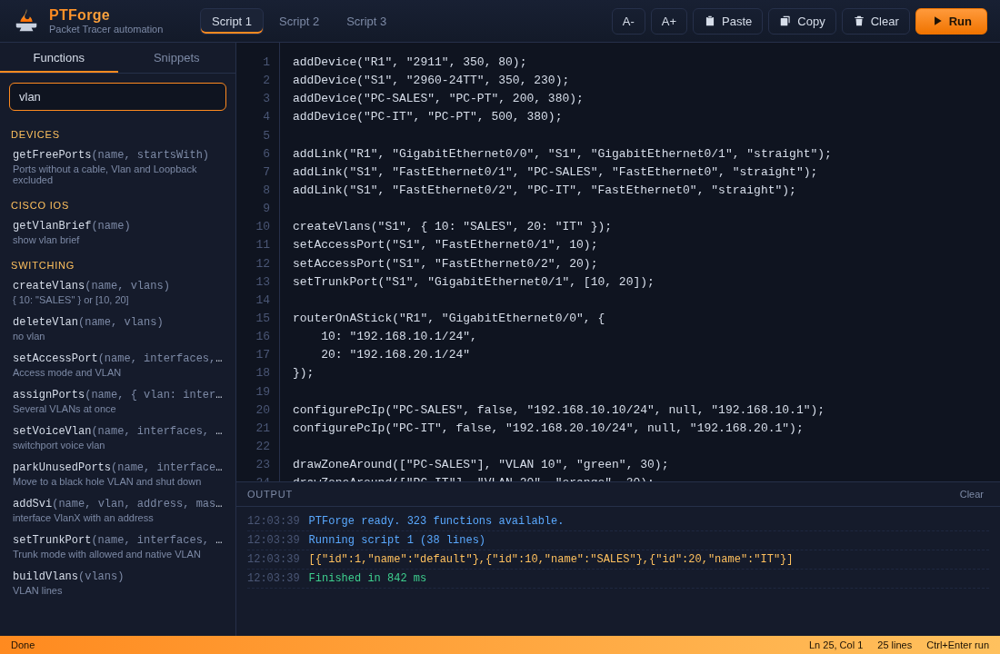

# Getting started

A ten minute tour. Install first: [installation](installation.md).

← [Documentation](../README.md)

## Open the editor

`Extensions` → `PTForge Editor`.



| Area | What it does |
|------|--------------|
| Script 1, 2, 3 | Three scripts, saved automatically |
| Functions | Search every function and click to insert it |
| Snippets | Ready blocks for common lab tasks |
| Run | Runs the script, `Ctrl+Enter`. `Ctrl+Shift+Enter` runs the selection |
| Output | Results, `log` lines, errors with line numbers and run time |

## Your first network

```js
addDevice("R1", "2911", 300, 100);
addDevice("S1", "2960-24TT", 300, 250);
addDevice("PC1", "PC-PT", 200, 400);
addDevice("PC2", "PC-PT", 400, 400);

addLink("R1", "GigabitEthernet0/0", "S1", "GigabitEthernet0/1", "straight");
addLink("S1", "FastEthernet0/1", "PC1", "FastEthernet0", "straight");
addLink("S1", "FastEthernet0/2", "PC2", "FastEthernet0", "straight");

basicSetup("R1", { secret: "class", consolePassword: "cisco", banner: "Authorized access only" });
setInterfaceIp("R1", "GigabitEthernet0/0", "192.168.1.1/24");

setPcStatic("PC1", "192.168.1.10/24", "192.168.1.1");
setPcStatic("PC2", "192.168.1.11/24", "192.168.1.1");

labelAllDevices();
```

Wait a few seconds for the link lights to turn green, then:

```js
showResult(ping("PC1", "192.168.1.1"));
log(getVlans("S1"));
```

`showResult` and `log` print to the Output panel. `log` never interrupts the script, so use it for progress messages.

## Everything is a function call

- Devices are referred to by name
- Ports are full names like `GigabitEthernet0/0`
- IOS functions send commands through the CLI, exactly like typing them
- IOS functions return an array of rejected lines. Empty means success

```js
var failed = setInterfaceIp("R1", "GigabitEthernet0/5", "10.0.0.1/24");
showResult(failed);
```

## Raw IOS when you need it

Anything the helpers do not cover can be sent directly:

```js
configureIosDevice("R1", [
    "ip dhcp pool LAN",
    " network 192.168.1.0 255.255.255.0",
    " default-router 192.168.1.1"
]);
```

## Mix loops and data

It is plain JavaScript:

```js
var vlans = { 10: "SALES", 20: "HR", 30: "IT" };
["S1", "S2", "S3"].forEach(function (sw) {
    createVlans(sw, vlans);
    setTrunkPort(sw, "GigabitEthernet0/1", [10, 20, 30]);
});
```

## Next

- [Writing scripts](writing-scripts.md)
- [API reference](../api/README.md)
- [Recipes](../recipes/README.md)
- The `examples/` folder has 27 complete labs
