<div align="center">

<picture>
  <source media="(prefers-color-scheme: dark)" srcset="../assets/brand/logo-dark.svg">
  
</picture>

<br><br>

**用 JavaScript 构建、配置、调试并验证完整的 Cisco Packet Tracer 网络。**

[](https://github.com/r4chan842/PTForge/releases/latest)
[](../LICENSE)


[快速开始](#快速开始) ·
[安装](../docs/guides/installation.md) ·
[文档](../docs/README.md) ·
[API](../docs/api/README.md) ·
[示例](../examples/README.md) ·
[CCNA 地图](../docs/ccna/README.md)

[English](../README.md) ·
[فارسی](README.fa.md) ·
[Deutsch](README.de.md) ·
[Español](README.es.md) ·
[Français](README.fr.md) ·
[Português](README.pt-BR.md) ·
[Русский](README.ru.md) ·
[Türkçe](README.tr.md) ·
[العربية](README.ar.md) ·
**中文** ·
[日本語](README.ja.md)

</div>

---

> 本文为译文，以[英文 README](../README.md) 为准。

## 为什么选择 PTForge

在 Packet Tracer 中搭建实验，意味着拖放设备、挑选线缆、打开每一个 CLI，并一遍又一遍地输入相同的命令。VLAN 列表或通配符掩码里的一个笔误就可能浪费一个小时。

PTForge 用脚本代替点击。只需描述一次网络，按下 **Run**，Packet Tracer 就会把它搭建出来：设备、模块、线缆、IOS 配置、服务器服务、无线、标签和区域。随后 PTForge 读取实时状态，让同一个脚本检查自己的成果。

- **可重复**：几秒内从零重建实验，想重建多少次都行
- **可分享**：实验就是一个文本文件，可以发送、审阅并保存在 Git 中
- **准确**：地址、掩码和通配符都由计算得出，笔误会给出清晰的错误信息
- **可验证**：检查函数直接从 Packet Tracer 读取 VLAN、Trunk、STP、端口安全和路由进程
- **可调试**：像在 VS Code 中一样设置断点、单步执行脚本并查看每个变量
- **交互式**：JavaScript 终端逐行修改当前打开的拓扑

<div align="center">
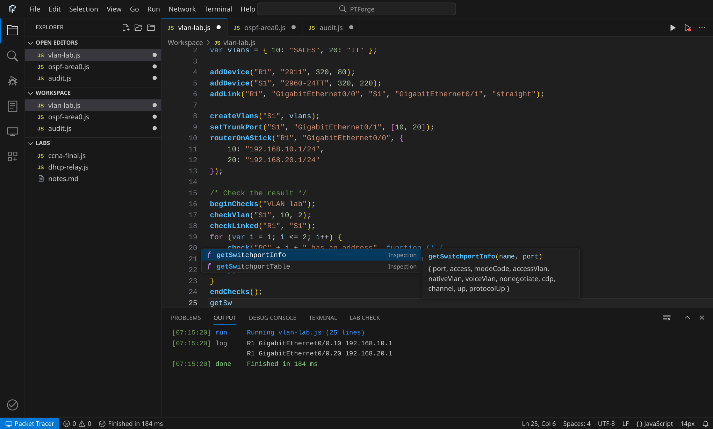
<br><sub>Packet Tracer 中的 PTForge 工作台：资源管理器、标签页、IntelliSense、Dark Modern 高亮和输出</sub>
</div>

## 1.2 新功能

|  |  |
|---|---|
| 🖥️ **JavaScript 终端** | `` Ctrl+` `` 打开一个类似 VS Code *New Terminal* 的终端。每一行都直接作用于当前拓扑，支持历史记录、Tab 补全以及 `.calc`、`.ping`、`.cli R1` 等点命令 |
| 🐞 **调试器** | `F5` 运行脚本并记录每一步。可在断点、条件断点和异常处暂停；支持单步跳过、单步进入、单步跳出和**后退**；查看 Variables、Watch 和 Call Stack，并在 Debug Console 中求值 |
| 🧮 **网络计算器** | IPv4 子网、子网划分、VLSM 规划、路由汇总、范围转 CIDR、通配符掩码、IPv6、EUI-64 和进制转换，都在一个编辑器标签页里 |
| 📡 **连通性矩阵** | `pingAll()` 从每台路由器和交换机 ping 每个地址，并以彩色矩阵显示丢包率和往返时间 |
| 📸 **快照与差异** | `takeSnapshot()` 保存设备、链路、地址、端口、电源状态和 running-config。比较两个快照并逐行查看配置差异 |
| 🎨 **Dark Modern** | 颜色、间距、标签页、面板和状态栏完全遵循 VS Code 的 Dark Modern 主题，调试时状态栏变为蓝色 |

## 快速开始

1. 下载[最新版本](https://github.com/r4chan842/PTForge/releases/latest)并按照[安装指南](../docs/guides/installation.md)操作
2. 打开 `Extensions` → `PTForge Editor`
3. 用 `Ctrl+O` 打开 [`examples/`](../examples/README.md) 中的脚本，按 `Ctrl+F5` 运行或按 `F5` 调试
4. 按 `` Ctrl+` `` 并在终端中试试 `getDevices()`
5. 用 `auditNetwork()`、`pingAll()` 或 [Lab Check](../docs/api/checks.md) 验证结果

## 快速示例

```js
buildLan({ switchName: "S1", hosts: 4, network: "192.168.10.0/24", x: 300, y: 250 });
addDevice("R1", "2911", 300, 80);
addLink("R1", "GigabitEthernet0/0", "S1", "GigabitEthernet0/1", "straight");

basicSetup("R1", { secret: "class", consolePassword: "cisco", banner: "Authorized access only" });
setInterfaceIp("R1", "GigabitEthernet0/0", "192.168.10.1/24");
configureSsh("R1", { domain: "lab.local", username: "admin", password: "Adm1n!Pass" });

createVlans("S1", { 10: "USERS", 99: "MGMT" });
setAccessPort("S1", ["FastEthernet0/1", "FastEthernet0/2"], 10, { portfast: true, bpduguard: true });
configurePortSecurity("S1", ["FastEthernet0/1", "FastEthernet0/2"], { maximum: 2 });

drawZoneAround(["S1", "PC1", "PC2", "PC3", "PC4"], "VLAN 10 - Users", "green");
labelAllDevices();

takeSnapshot("baseline");
pingAll();
```

二十行代码即可得到一台路由器、一台交换机、四台已分配地址的 PC、一台启用 SSH 的加固路由器、VLAN、受保护的接入端口、带标签的拓扑图、一个已保存的基线快照以及完整的连通性测试。

## 功能

| 领域 | 你可以做什么 |
|---|---|
| 🖥️ **设备** | 添加、删除、重命名、移动、重启、安装模块、读取端口、保存自定义数据、在物理工作区中放置设备 |
| 🔌 **链路** | 任意线缆类型、删除链路、自动连接、列出邻居、检查链路状态 |
| 💻 **主机** | 静态或 DHCP IPv4、带 SLAAC 的 IPv6、网关、DNS、防火墙、命令提示符 |
| ⚙️ **Cisco IOS** | 基础配置、密码、横幅、用户、接口、子接口、环回口、单臂路由、DHCP 地址池与中继、NTP、syslog、SNMP、CDP、LLDP、show 命令 |
| 🔀 **交换** | VLAN、接入与语音端口、Trunk、DTP、EtherChannel（LACP、PAgP、静态、三层）、Rapid PVST+、PortFast、BPDU Guard、VTP、端口安全、DHCP Snooping、DAI |
| 🧭 **路由** | 静态与浮动路由、OSPF、OSPFv3、EIGRP、IPv6 EIGRP、RIP、RIPng、BGP、重分发 |
| 🛡️ **安全** | 标准、扩展、命名和 IPv6 ACL，NAT、PAT、NAT 地址池、端口转发、SSH、登录锁定、结合 RADIUS 与 TACACS+ 的 AAA |
| ♻️ **冗余** | 在单台路由器上或以主备对形式配置 HSRP |
| 🗄️ **服务器** | DHCP、DNS（A、CNAME、NS）、HTTP、HTTPS、网页、FTP 用户、邮件账户、TFTP、syslog、RADIUS |
| 📶 **无线** | SSID、WPA2、WPA、WEP、射频模式、隐藏 SSID、MAC 过滤 |
| 🔍 **检查** | 交换机端口状态、端口安全计数、VLAN 数据库、STP 根桥与根端口、VTP、静态 MAC、OSPF 与 EIGRP 进程 |
| 📡 **连通性** | `pingAll`、`pingMatrix` 和 `reachability`，含丢包、往返时间和矩阵视图 |
| 📸 **快照** | `takeSnapshot`、`getSnapshots`、`compareSnapshots`、`showSnapshotDiff`，保存和加载快照文件，以及配置差异视图 |
| 📁 **文件** | 读写文本文件、从磁盘运行脚本、导出配置和拓扑、命令日志 |
| 🎨 **画布** | 便签、直线、圆、矩形、箭头、虚线、区域、设备与链路标签、图层 |
| 🗺️ **拓扑** | 星型、环型、线型、网状和 LAN 生成器，网格与圆形布局，VLSM 与 /30 规划器 |
| 🧪 **模拟** | 模拟模式、PDU、协议过滤、单步执行、ping、traceroute |
| ✅ **Lab Check** | 带分数、提示和报告的评分检查：设备、线缆、地址、端口、主机名、VLAN、配置行、自定义测试 |
| 🩺 **审计** | 重复 IP、同一线缆两端的子网冲突、断开的链路、无地址主机、位于 VLAN 1 的接入端口、缺失的端口安全、未使用的开启端口 |
| 📟 **批处理** | `runOnAll("show ip int brief")`、`runOnDevices`，以及能把 CLI 中输入的命令转换为可复用脚本的 `commandsToScript()` |
| 🪟 **工作区** | 缩放、背景、远程网络、打开和保存项目、工作区事件 |

每个 IOS 辅助函数都有一个 `build...` 孪生函数，它返回命令而不是发送命令，方便你查看、组合和复用配置。

## 编辑器

<div align="center">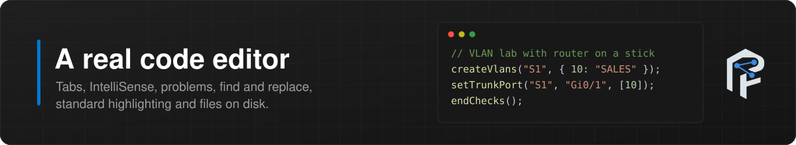</div>

工作台的外观和操作都与 VS Code 一致。它完全用纯 ES5 从零编写，因此可以在 Packet Tracer 的 web view 中运行，无需任何框架或网络访问。

| 部分 | 说明 |
|---|---|
| **菜单栏与命令面板** | File、Edit、Selection、View、Go、Run、Network、Terminal 和 Help 菜单。`Ctrl+Shift+P` 列出所有命令，`Ctrl+P` 跳转到文件，`Ctrl+G` 跳转到行 |
| **资源管理器** | 打开的编辑器、保存在 Packet Tracer 中的脚本工作区，以及磁盘上的真实文件夹。新建、重命名、删除 |
| **文件** | Open、Save 和 Save As 使用 Packet Tracer 的文件对话框。可从剪贴板导入，也可导出为下载 |
| **标签页** | 每个文件一个标签页，带修改标记，中键关闭，磁盘文件关闭前提示保存，每个标签页有独立的撤销历史 |
| **高亮** | Dark Modern 配色：注释 `#6A9955`、字符串 `#CE9178`、数字 `#B5CEA8`、关键字 `#569CD6` 和 `#C586C0`、函数 `#DCDCAA`、变量 `#9CDCFE`、PTForge 函数加粗 `#4FC1FF`、彩色括号配对 |
| **IntelliSense** | 来自全部 388 个函数的建议，带签名和说明，以及文件中的单词和关键字。输入时显示参数提示 |
| **问题** | 实时语法检查并定位到具体行，未知函数名提供 *Did you mean* 快速修复。波浪线、边栏标记和 Problems 面板 |
| **编辑** | 自动闭合配对、智能回车、`Ctrl+/` 注释、`Alt+Up/Down` 移动行、`Shift+Alt+Down` 复制行、`Ctrl+Shift+K` 删除行、括号匹配 |
| **查找与替换** | `Ctrl+F` 和 `Ctrl+H`，支持区分大小写、全字匹配和正则表达式，全部替换只需一次撤销 |
| **面板** | Problems、Output、Debug Console、Terminal 和 Lab Check。可调整大小，`Ctrl+J` 隐藏 |
| **Devices 视图** | 实时设备和端口，带链路指示灯和地址，一键使用快照和网络工具 |
| **状态栏** | 问题数量、运行与调试状态、光标位置、缩放、与 Packet Tracer 的连接 |

<table>
<tr>
<td>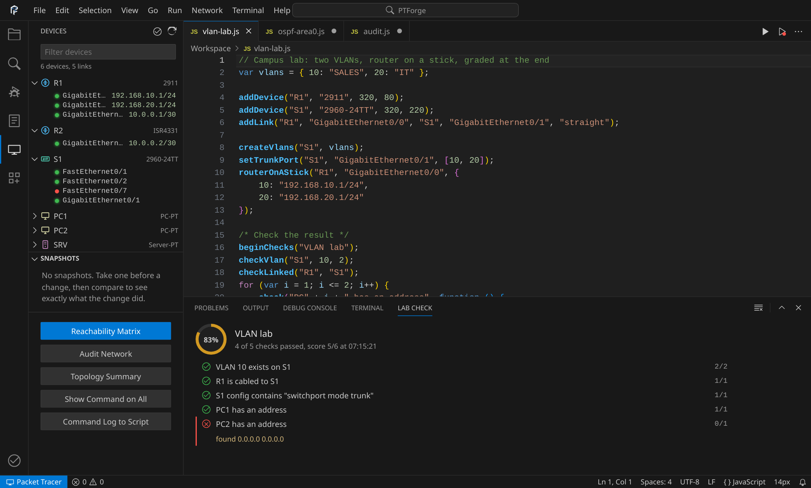<br><sub>Lab Check 报告与实时 Devices 视图</sub></td>
<td>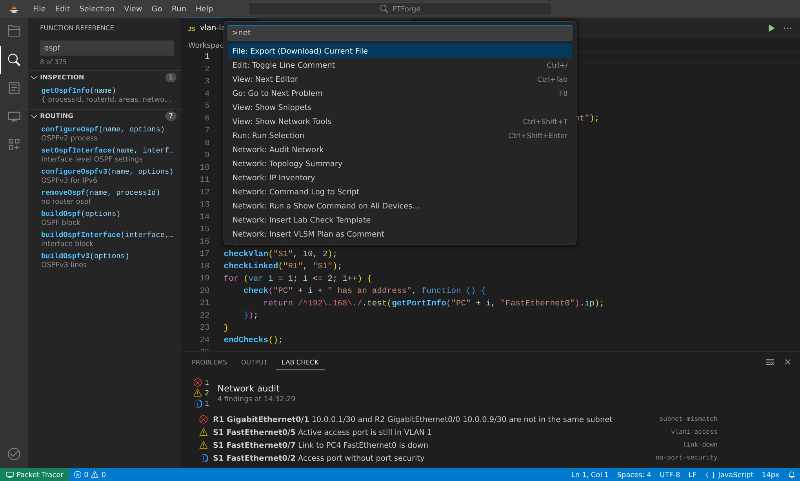<br><sub>命令面板与函数参考</sub></td>
</tr>
<tr>
<td>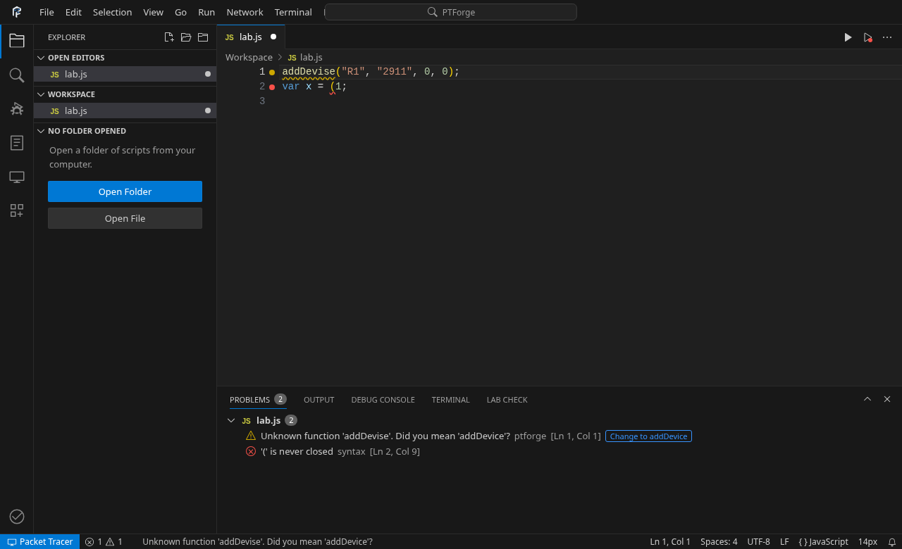<br><sub>带快速修复的 Problems</sub></td>
<td>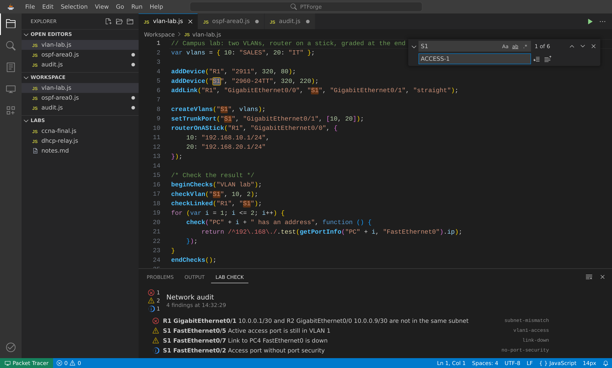<br><sub>查找与替换</sub></td>
</tr>
</table>

## 终端

<div align="center"></div>

`` Ctrl+` `` 打开 JavaScript 终端。每一行都会立即在 Packet Tracer 中执行并保留变量，因此你无需先写脚本，就能一步步探索和修改拓扑。

| 功能 | 说明 |
|---|---|
| **直接求值** | 任意表达式或语句；结果以易读的树形显示，错误显示为红色 |
| **补全** | `Tab` 补全 PTForge 函数、你的变量、关键字和点命令 |
| **历史** | `Up` 和 `Down` 浏览之前的命令，历史在会话之间保留 |
| **多个终端** | `+` 新建终端，下拉列表切换终端，垃圾桶关闭终端 |
| **点命令** | `.help`、`.clear`、`.devices`、`.ping`、`.trace`、`.show R1 show ip route`、在设备上执行 IOS 命令的 `.cli R1`、退出用 `.exit`、`.audit`、`.snap`、`.diff`、`.calc 10.1.2.3/20`、`.run file.js`、`.history` |

<div align="center">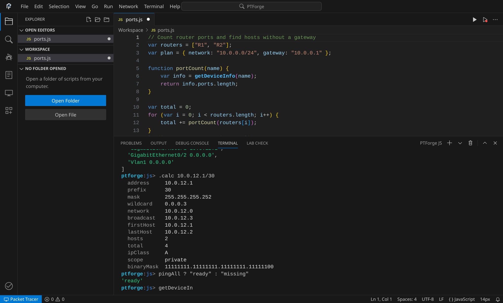</div>

阅读[终端指南](../docs/guides/terminal.md)。

## 调试器

<div align="center">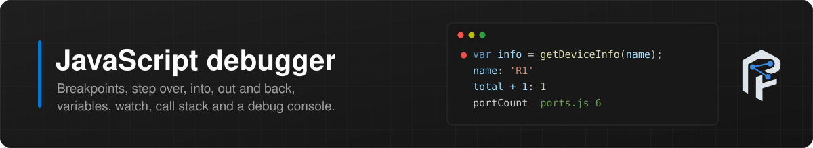</div>

`F5` 启动调试会话。PTForge 对脚本进行插桩，在 Packet Tracer 中运行一次并记录每一步，然后停在第一个断点。由于整个运行过程都已记录，你还可以**后退**。

| 功能 | 说明 |
|---|---|
| **断点** | 点击边栏或按 `F9`。条件断点、命中次数、日志点、全部禁用或删除 |
| **异常** | 在未捕获的异常处暂停并高亮该行 |
| **单步** | 继续 `F5`、单步跳过 `F10`、单步进入 `F11`、单步跳出 `Shift+F11`、后退、重启 `Ctrl+Shift+F5`、停止 `Shift+F5` |
| **Variables** | Local、Closure 和 Script 作用域，以可展开的树显示 |
| **Watch** | 任意表达式，在每个记录的步骤上求值 |
| **Call Stack** | 每个栈帧及其文件和行号。点击栈帧查看其变量 |
| **Debug Console** | 在暂停的栈帧中对表达式求值 |
| **悬停** | 在编辑器中悬停变量即可查看其值 |

<div align="center">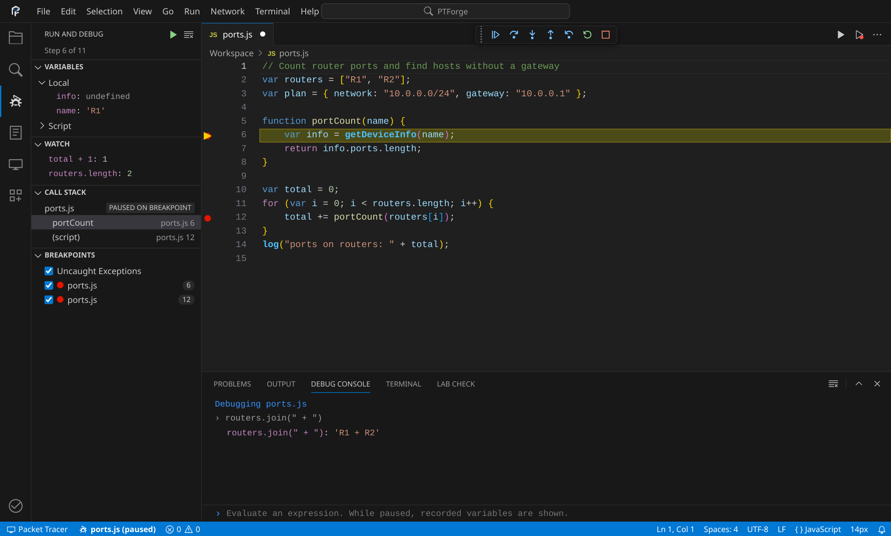</div>

阅读[调试器指南](../docs/guides/debugger.md)。

## 网络工具

<div align="center">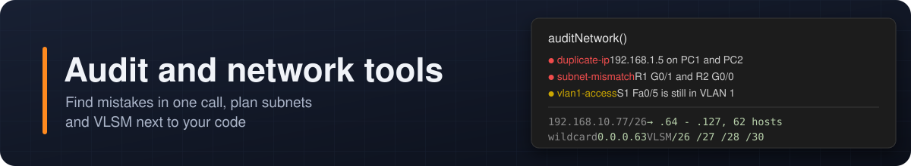</div>

```js
pingAll();
takeSnapshot("before");
configureOspf("R1", { routerId: "1.1.1.1", networks: ["10.0.0.0/30"] });
compareSnapshots("before");
```

<table>
<tr>
<td>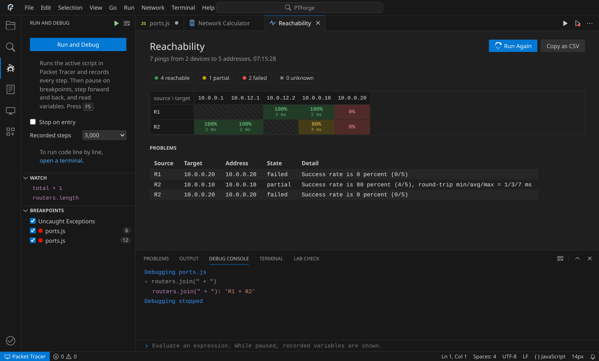<br><sub><code>pingAll()</code> 连通性矩阵</sub></td>
<td>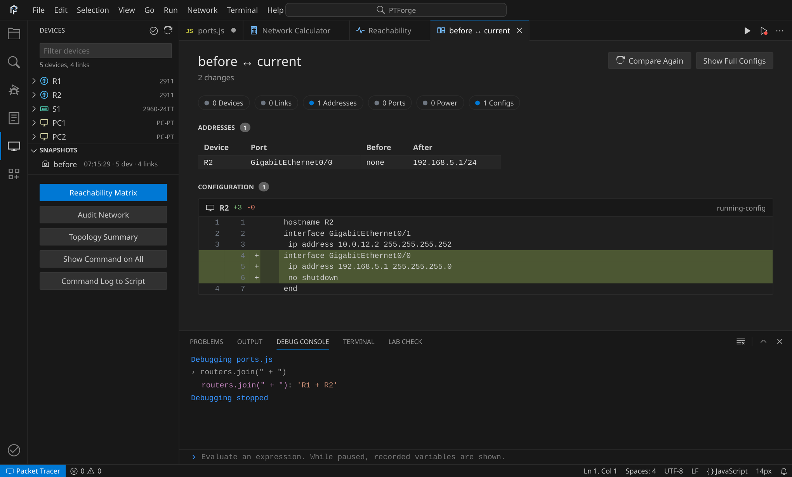<br><sub>快照比较与配置差异</sub></td>
</tr>
<tr>
<td>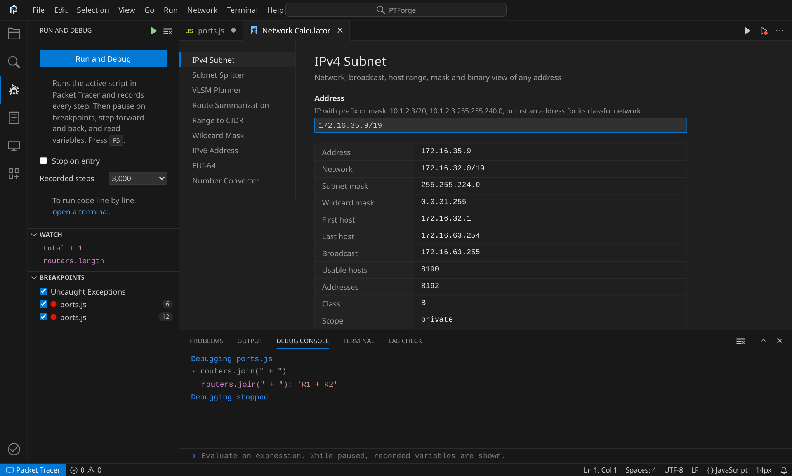<br><sub>IPv4 子网计算器</sub></td>
<td>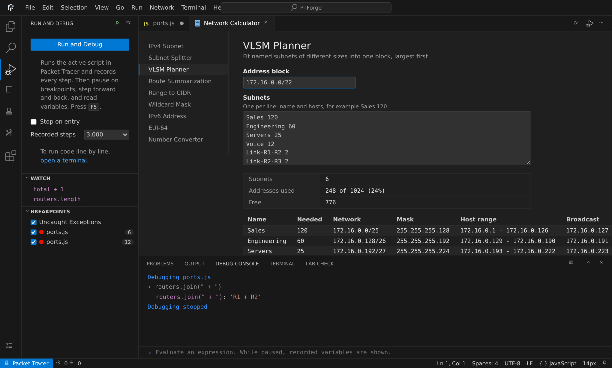<br><sub>VLSM 规划器</sub></td>
</tr>
</table>

阅读[网络工具](../docs/guides/network-tools.md)、[连通性](../docs/api/simulation.md#reachability)和[快照](../docs/api/snapshots.md)。

## 验证与审计

<div align="center">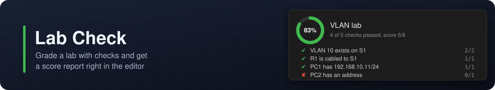</div>

```js
beginChecks("VLAN lab");
checkVlan("S1", 10, 2);
checkLinked("R1", "S1");
checkIpAddress("PC1", "FastEthernet0", "192.168.10.11", 24);
checkConfigContains("S1", "switchport mode trunk");
endChecks();

auditNetwork();
runOnAll("show ip interface brief");
```

阅读 [Lab Check](../docs/api/checks.md)、[审计](../docs/api/audit.md)和[批处理命令](../docs/api/ios.md#batch-commands)。

## 安装

PTForge 是一个 Packet Tracer Script Module。Packet Tracer 会加密 `.pts` 包，且只有它自己能创建这类包，因此你需要用本仓库中的文件构建一次模块。

1. 下载[最新版本](https://github.com/r4chan842/PTForge/releases/latest)或克隆仓库
2. 在 Packet Tracer 中打开 `Extensions` → `Scripting` → `Configure PT Script Modules`
3. 创建名为 `PTForge` 的模块
4. 添加一个脚本文件，内容为 [`release/ptforge.js`](../release/ptforge.js)
5. 将 [`src/ui`](../src/ui) 中的十四个文件添加为界面文件：`index.html`, `style.css`, `catalog.js`, `snippets.js`, `highlight.js`, `lint.js`, `netcalc.js`, `editor.js`, `acorn.js`, `instrument.js`, `terminal.js`, `debugview.js`, `views.js`, `interface.js`
6. 保存并启动模块，然后打开 `Extensions` → `PTForge Editor`

[安装指南](../docs/guides/installation.md)详细介绍了每个步骤和更新方法。

## 示例

[`examples/`](../examples/README.md) 中有 34 个完整实验，每个都从空白工作区开始：

| 文件夹 | 实验 |
|---|---|
| `01-basics` | 第一个网络、模块与串行链路、安全基础配置 |
| `02-switching` | VLAN 与 Trunk、EtherChannel、STP 根桥、三层交换机 |
| `03-routing` | 静态路由、多区域 OSPF、EIGRP、BGP、IPv6 与 OSPFv3 |
| `04-security` | ACL、NAT 与 PAT、SSH 与端口安全、HSRP |
| `05-services` | 服务器 DHCP、DNS 与 Web、FTP 与邮件、路由器 DHCP 与中继 |
| `06-wireless` | 家庭无线网络 |
| `07-canvas` | 标签与区域 |
| `08-topology` | 自动生成的园区网、星型、环型与网状、VLSM 规划 |
| `09-simulation` | Ping 测试 |
| `10-ccna-labs` | 单臂路由、完整企业实验 |
| `11-inspection` | 交换验证、端口安全审计 |
| `12-automation` | 配置备份、命令审计、脚本库 |
| `13-operations` | 连通性测试、用快照跟踪变更 |

[`templates/`](../templates/README.md) 提供了起步模板：空白实验、园区网、分支 WAN 和小型办公室。

## 文档

| 章节 | 内容 |
|---|---|
| [入门](../docs/guides/getting-started.md) | 十分钟搭建第一个网络 |
| [编辑器指南](../docs/guides/editor.md) | 工作区、文件、IntelliSense、问题 |
| [终端](../docs/guides/terminal.md) | 交互式 JavaScript 与设备 CLI |
| [调试器](../docs/guides/debugger.md) | 断点、单步、变量与监视 |
| [网络工具](../docs/guides/network-tools.md) | 计算器、连通性与快照 |
| [编写脚本](../docs/guides/writing-scripts.md) | 结构、顺序、build 函数、速度 |
| [API 参考](../docs/api/README.md) | 每个函数的参数、返回值和示例 |
| [实践指南](../docs/recipes/README.md) | 园区交换、路由实验、边缘路由器、服务器、拓扑图 |
| [CCNA 主题地图](../docs/ccna/README.md) | CCNA 200-301 主题及对应的函数和示例 |
| [速查表](../docs/cheatsheets/ios-to-ptforge.md) | IOS 到 PTForge、子网划分、编辑器快捷键 |
| [架构](../docs/architecture/overview.md) | 分层、运行时、编辑器桥接、调试器、测试 |
| [故障排除](../docs/guides/troubleshooting.md) | 常见错误与解决方法 |
| [限制](../docs/guides/limitations.md) | Packet Tracer API 不支持的内容 |
| [常见问题](../docs/guides/faq.md) | 简短解答 |

## 项目结构

```
PTForge/
├── .github/
├── assets/
│   ├── brand/
│   ├── banners/
│   └── screenshots/
├── docs/
│   ├── api/
│   ├── architecture/
│   ├── ccna/
│   ├── cheatsheets/
│   ├── guides/
│   ├── recipes/
│   └── reference/
├── examples/
├── i18n/
├── release/
├── src/
│   ├── api/
│   ├── core/
│   ├── data/
│   ├── lib/
│   └── ui/
├── templates/
├── tests/
└── tools/
```

## 开发

需要 Node.js 18 或更高版本。没有运行时依赖。

```
git clone https://github.com/r4chan842/PTForge.git
cd PTForge
npm run check
```

| 命令 | 用途 |
|---|---|
| `npm test` | 运行全部测试 |
| `npm run bundle` | 重新构建 `release/ptforge.js` |
| `npm run catalog` | 从 `docs/api` 生成编辑器的函数列表 |
| `npm run reference` | 从 `src/data` 生成参考表格 |
| `npm run check` | 函数列表、打包、语法检查和测试 |
| `npm run ui-test` | 使用 Playwright 对工作台、终端和调试器进行 41 项浏览器检查 |
| `npm run screenshots` | 重新生成 `assets/screenshots` 中的截图 |

测试套件在 Packet Tracer IPC API 的模拟实现上运行整个扩展，覆盖每个公开函数、每个示例、模板和实践指南、打包文件、终端与调试器引擎以及项目规则。详见[测试](../docs/architecture/testing.md)。

## 参与贡献

欢迎提交错误报告、想法和 Pull Request。请先阅读 [CONTRIBUTING](../CONTRIBUTING.md)，查看[路线图](../ROADMAP.md)，并遵守[行为准则](../CODE_OF_CONDUCT.md)。安全问题请通过[安全策略](../SECURITY.md)报告。提问：[SUPPORT](../SUPPORT.md)。

## 许可证

PTForge 以 [MIT 许可证](../LICENSE)发布。调试器使用了 [Acorn](https://github.com/acornjs/acorn)（MIT），参见 [THIRD_PARTY_NOTICES](../THIRD_PARTY_NOTICES.md)。

## 致谢

Packet Tracer API 的使用遵循官方的 [Cisco Packet Tracer IPC API 文档](https://tutorials.ptnetacad.net/help/default/IpcAPI/classes.html)。工作台配色遵循 VS Code 的 Dark Modern 主题。

Cisco 和 Packet Tracer 是 Cisco Systems, Inc. 的商标。本项目与 Cisco Systems, Inc. 无关联，也未获得 Cisco 的认可。

<div align="center">
<sub>献给网络专业的学生、教师，以及所有不想把同一个实验手动搭建两次的人。</sub>
</div>
